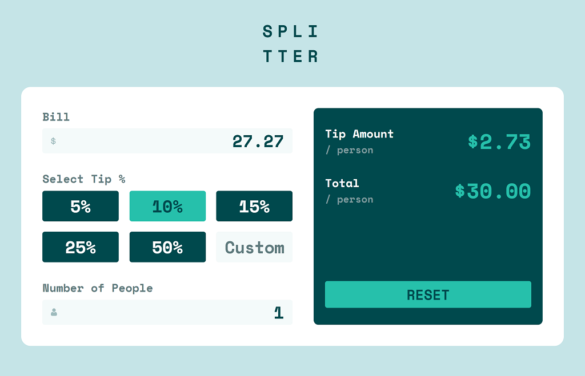

# Frontend Mentor - Tip Calculator App

This is a solution to the [Tip calculator app challenge on Frontend Mentor](https://www.frontendmentor.io/challenges/tip-calculator-app-ugJNGbJUX). Frontend Mentor challenges help you improve your coding skills by building realistic projects.

## Table of contents

-   [Overview](#overview)
    -   [The challenge](#the-challenge)
    -   [Screenshot](#screenshot)
    -   [Links](#links)
-   [My process](#my-process)
    -   [Built with](#built-with)
    -   [What I learned](#what-i-learned)
    -   [Continued development](#continued-development)
-   [Author](#author)

## Overview

### The challenge

Users should be able to:

-   View the optimal layout for the app depending on their device's screen size
-   See hover states for all interactive elements on the page
-   Calculate the correct tip and total cost of the bill per person

### Screenshot

### Links

-   Solution URL: [GitHub](https://github.com/emekler0729/fem-tip-calculator-app)
-   Live Site URL: [GitHub Pages](https://emekler0729.github.io/fem-tip-calculator-app/)

## My process

### Built with

-   CSS
-   Mobile-first workflow
-   [React](https://reactjs.org/) - JS library
-   [Styled Components](https://styled-components.com/) - For styles

### What I learned

This was a great practice opportunity to create an app using the React and Styled Components tools which I am fairly new to.

The biggest challenge with this project was effectively validating user input and ensuring the output is responsive for the full range of valid inputs. To avoid issues with floating point arithmetic and loss of precision on user input, I validated user input as strings using RegExes prior to converting them to their numeric values.

For my implementation, I chose to limit the range of the user's input to less than $1,000,000 for the bill, less than 1000% for the tip, and less than 1000 people. My hypothesis is that this will cover typical use cases without drastically limited the utility of the calculator; however, there is certainly room for improvement in this approach.

### Continued development

The input validation could continue to be improved, especially on iOS. As currently implemented, iOS does not allow for a decimal value to be entered into the bill. To overcome this, I would change the architecture to track the displayed input and the values used for calculation separately.

## Author

-   Website - [Eduard Mekler](https://github.com/emekler0729)
-   Frontend Mentor - [@emekler0729](https://www.frontendmentor.io/profile/emekler0729)
